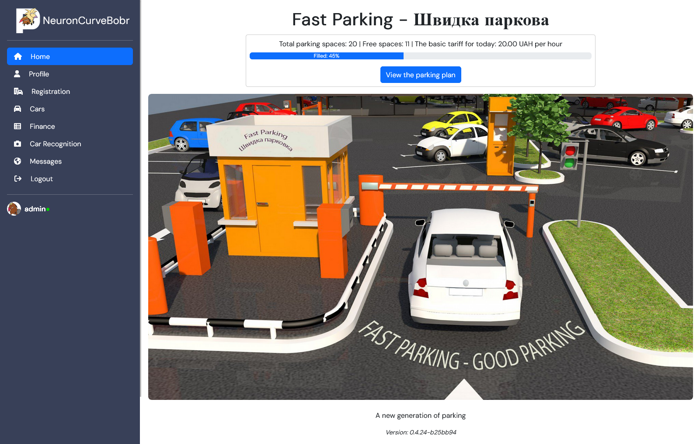

# Fast Parking
"Fast Parking" це веб-застосунок, який автоматично може визначати номери автомобільних знаків на зображеннях, відстежити тривалість паркування для кожного унікального транспортного засобу та розраховувати накопичені паркувальні витрати.

### Функції застосунку:

- Управління обліковими записами користувачів;
- Приймання зображень від користувача. Детекція номерного знаку. Виявлення та виділення області з номерним знаком; 
- Розпізнавання символів для ідентифікації тексту номерного знаку;
- Перевірка номера авто у базі зареєстрованих транспортних засобів;
- Запис часу в'їзду/виїзду кожного разу, коли визначається номерний знак. Відстеження тривалості паркування;
- Розрахунок загальної тривалості паркування;
- Зберігання даних про тривалість паркування в базі даних;
- Розрахунок вартості паркування. Керування тарифами. Чек за QR-кодом;
- Генерація звітів про розрахунки, які можна експортувати у форматі CSV;
- Real Time сповіщення для подій в'їзду/виїзду у Telegram;
- Візуалізація про кількість вільних та зайнятих паркомісць.

<details open>
  <summary style="display: flex; align-items: center; color: #0088CC; margin-bottom: -5px; margin-top: 0px;"><span style="margin-right: 5px;"></span><h2>
  License plate recognition application (screenshots)</h2></summary>

<div align="left" width="948" height="474">
  
</div>

Home

<div align="left" width="948" height="474">
  
</div>

Parking plan from the point of view of users with their cars

<div align="left" width="948" height="474">
  
</div>


<details>
  <summary style="display: flex; align-items: center; color: #0088CC; margin-bottom: -20px; margin-top: 0px;"><span style="margin-right: 5px;"></span><h3>Check-in and Check-out by cars </h3></summary>

Car recognition In

<div align="left" width="948" height="474">
  
</div>

Car recognition Out

<div align="left" width="948" height="474">
  
</div>

Cars

<div align="left" width="948" height="474">
  
</div>

Registration list

<div align="left" width="948" height="474">
  
</div>
</details>


<details>
  <summary style="display: flex; align-items: center; color: #0088CC; margin-bottom: -20px; margin-top: 0px;"><span style="margin-right: 5px;"></span><h3>User account </h3></summary>

Profile

<div align="left" width="948" height="474">
  
</div>

User cars

<div align="left" width="948" height="474">
  
</div>

Registration

<div align="left" width="948" height="474">
  
</div>

SignIn

<div align="left" width="948" height="474">
  
</div>
</details>


<details>
  <summary style="display: flex; align-items: center; color: #0088CC;margin-bottom: -20px; margin-top: 0px;"><span style="margin-right: 5px;"></span><h3>Payments </h3></summary>

Finance

<div align="left" width="948" height="474">
  
</div>

<div align="left" width="948" height="474">
  
</div>

<div align="left" width="948" height="474">
  
</div>

<div align="left" width="948" height="474">
  
</div>

<div align="left" width="948" height="474">
  
</div>

</details>

<details>
  <summary style="display: flex; align-items: center; color: #0088CC; margin-bottom: -20px; margin-top: 0px;"><span style="margin-right: 5px;"></span><h3>Manage notifications </h3></summary>

Messages

<div align="left" width="948" height="474">
  
</div>

Telegram
<div align="left" width="948" height="474">
  
</div>

<div align="left" width="948" height="474">
  
</div>

<div align="left" width="948" height="474">
  
</div>
</details>

<details>
  <summary style="display: flex; align-items: center; color: #0088CC; margin-bottom: -20px; margin-top: 0px;"><span style="margin-right: 5px;"></span><h3>Mobile devices</h3></summary>

Adaptive layout
<div align="left" width="948" height="474">
  
</div>

</details>

## Presentation
#### Application deployment and demonstration

Youtube: https://youtu.be/BkJmMh1Nvzk

#### Project presentation and main benefits
Youtube: https://www.youtube.com/watch?v=iH9t5hpYwqI

</details>


<details>
  <summary style="display: flex; align-items: center; color: #0088CC;"><span style="margin-right: 5px;"></span><h1>Development environment</h1></summary>

## env file
На основі файлу `deploy/env-examples` створюємо власний  `deploy/.env` з власними змінними

<details>
  <summary style="display: flex; align-items: center; color: #0088CC;"><span style="margin-right: 5px;"></span><h2>LOCAL DEVELOPMENT</h2></summary>

- git проекту: https://github.com/AlexanderBgit/PlateN , default branch `dev`

- кожен створює власні гілки від `dev` і оновлює їх через `merge`. Іменна гілок `usernmae` - постійна користувача, `usernmae-feature` тимчасова, після об'єднання з іншими гілками знищується.

- merge to `dev` тільки через `pull-request` і запит користувачам на підтвердження, мінімум один має підтвердити, і тоді розблокується кнопка `Merge`, і можна об'єднати у `dev`.

- Python >=3.10,<3.12

- poetry

- Django 5

- Скрипти `.cmd` для виконання у операційній системі Windows тільки.

- Скрипти `.sh` для виконання у операційній системі Linux, Mac.

- Корінь git проекту має декілька незалежних підпроєктів:
    - BACKEND
    - FRONTEND
    - Database
    - DS

- Кожен підпроєкт - незалежний продукт, і відповідно має свій незалежний Docker. 

- Спілкуються через спільну базу даних, при розробці це може бути локальна з Docker або віддалена у elephantsql.

- Налаштування змінних середовища - спільні у файлі /deploy/.env. Локальна розробка використовує тільки відносний шлях до цього файлу. Наприклад код з `fastparking\fastparking\settings.py`: 
```
BASE_DIR = Path(__file__).resolve().parent.parent
env_file = BASE_DIR.parent.parent.joinpath("deploy").joinpath(".env")
if env_file.exists():
    load_dotenv(env_file) 
else:
    print("ENV file not found:", env_file)
```

- _Security_. Кожен докер при старті бере налаштування з .env котрі йому тільки потрібні, а не весь файл. Розміщується .env файл тільки за межами докер контейнера.

- FRONTEND має власне віртуальне оточення poetry.

- BACKEND має власне віртуальне оточення poetry

- DS - робочі файли для Data Science

- Для роботи з FRONTEND:
    - переходимо у теку FRONTEND, активуємо віртуальне сердобине `poetry shell`
    - Далі `poetry update` встановить або оновить пакунки субпроєкту.

- Для роботи з BACKEND:
    - переходимо у теку BACKEND, активуємо віртуальне сердобине `poetry shell`
    - Далі `poetry update` встановить або оновить пакунки субпроєкту.

- Якщо у VC Code створити Workspace, додати до нього підпроєкти як (File->Add folder to WorkSpace), то при запуску терміналу буде запити з якої теки ви це хочете зробити.

 - Для роботи з локальною базою даних використовуємо настуні кроки (Local Database postgres). Для роботи з віддаленою базою даних пропускаємо ці кроки.
</details>

<details>
  <summary style="display: flex; align-items: center; color: #0088CC;"><span style="margin-right: 5px;"></span><h2>Local Database postgres</h2></summary>

#### run database postgres docker container

`scripts/docker_db.cmd`

Данні бази будуть створенні у теці `Database\postgres-data\`

Тека додана у виключення git - не викладати у git, у кожного вона своя!

#### stop database postgres docker container
`scripts\docker_db_stop.cmd`
</details>

<details>
  <summary style="display: flex; align-items: center; color: #0088CC;"><span style="margin-right: 5px;"></span><h2>Launching and maintenance of the app in docker</h2></summary>

#### run app locally
Запускати з віртуального оточення poetry
```
cd FRONTEND/fastparking
python manage.py runserver 0.0.0.0:8000
```
`scripts\run_dev_app.cmd`

#### export poetry package to requirements.txt
Запускати з віртуального оточення poetry
```
cd FRONTEND
poetry export --without-hashes > requirements.txt
```
`scripts\gen_req_txt.cmd`

#### migrate db changes
```
cd FRONTEND/fastparking
python manage.py migrate
```

#### Автоматичне створення супер адміністратора Django з оточення .env

`scripts\create_django_auto_admin.cmd`

#### Запуск всього проєкту з підпроєктами у докер

##### run project (db+code) docker container
Данні бази будуть створенні у теці `Database\postgres-data\`

`scripts\docker_app_run.cmd`

Режим DEBUG - консолі 

##### rebuild project (code) docker container
`scripts\docker_app_build.cmd`
</details>


<details>
  <summary style="display: flex; align-items: center; color: #0088CC;"><span style="margin-right: 5px;"></span><h2>Connection procedure dev - Django from scratch:</h2></summary>

1. git checkout dev
1. git pull
1. cd FRONTEND
1. poetry shell
1. poetry update
1. cd ..
1. cd scripts
1. docker_db.cmd - run DB local docker, skip if remote used postgres
1. create_django_auto_admin.cmd - create admin aromatically from .env
1. run_dev_app.cmd - run app
1. open browser: http://127.0.0.1:8000
</details>

<details>
  <summary style="display: flex; align-items: center; color: #0088CC;"><span style="margin-right: 5px;"></span><h2>SERVER SIDE DEPLOY - CI/CD</h2></summary>


<details>
  <summary style="display: flex; align-items: center; color: #0088CC;"><span style="margin-right: 5px;"></span><h3>CI перевірка коду </h3></summary>


Перевірка коду проєкту на збирання проходить автоматично у кожному "GitHub pull request" безпосередньо перед об'єднанням з гілкою `dev` функцію Action GitHub.

Але без повірки міграції.

Action GitHub використовує налаштуванням з файлу `.github\workflows\django.yml` де проходить перевірка на збирання середовища виконання для трьох версії python:  `python-version: ["3.10", "3.11"]`. 

Безпосереднє тестування проєкту Django автоматично виконується командую `python manage.py test`.
</details>

<details>
  <summary style="display: flex; align-items: center; color: #0088CC;"><span style="margin-right: 5px;"></span><h3>CD </h3></summary>

Сервер: Linux (Debian).

Локальний користувач для виконання задач без прав адміністратора.

На сервері проект виконуються у декількох `docker` контейнерах, котрі об'єднані файлом налаштувань: `deploy\docker-compose-project.yml`.

Для визначення події з необхідності виконати операцію повторного `deploy` - періодично виконується скрипт: `scripts\detect_changes_git.sh`. 

Цей скрипт визначає чи не змінилася віддалена гілка проекту `dev`. 

Якщо зміни виявленні то виконується скрипт - `scripts\re_deploy_docker.sh`.

Для налаштувань під конкретні умови середовища виконання файл `detect_changes_git` копіюємо за межі теки проєкту.

У нас це рівень вище `~/PlateN/`, та змінюємо локальний шлях до теки проєкту у змінній `SOURCE`.  
```
SOURCE=${HOME}/PlateN/PlateN
```

Для налаштування системного планувальника завдань використано команду `crontab -e`.

Де додано наступний рядок: 
```
*/15 * * * *  ~/PlateN/detect_changes_git.sh > /dev/null 2>&1
```
 Що дозволяє запускати скрипт `detect_changes_git.sh` кожні 15 хвилин.
</details>

</details>

</details>

## Development team
1. Team Lead [@artem-dorofeev](https://github.com/artem-dorofeev) 
1. Scrum Master [@RostislavB74](https://github.com/RostislavB74) 
1. Django expert [@lumi-ua](https://github.com/lumi-ua) and 
[@diixo](https://github.com/diixo) 
1. Full stack devops [@lexxai](https://github.com/lexxai) 
2. Art director [@plaha303](https://github.com/plaha303) 
3. Tester [@AlexanderBgit](https://github.com/AlexanderBgit) 

<div align="left" width="948" height="474">
  
</div>


## Live Demo
https://fastparking.x-server.net/

Can use a special demo version of the site with specially created users of different roles: admin, operator, user.
<div align="left" width="948">
  
</div>


